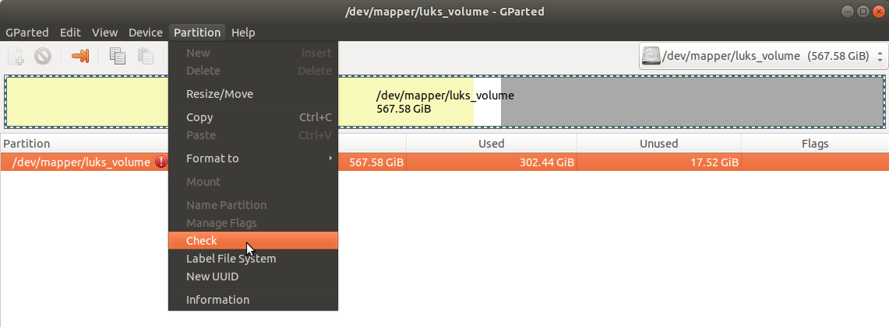

# How to Resize Bitlocker and LUKS Encrypted Partitions 

On my laptop, I use both Windows 10 and Ubuntu 18.04 LTS. When I first installed Linux a few months ago, I allocated 1/3 of the disk to Linux. But these days I am using more the Linux partition, and that partition is getting full.

I was looking for a way to resize the partitions (both encrypted, with BitLocker on Windows and LUKS on Ubuntu) without having to reinstall everything. And it turned out to be simpler than I would have imagined!

Below are my notes. In my case, everything went well, but don't forget to backup your data and configuration in case you get less lucky...

## Resize the BitLocker Encrypted Partition with Windows

Resizing a Bitlocker encrypted partition is super easy if you do it with the right tool!

Boot your computer under Windows.

Before we start, you may want to know what consumes disk space, and maybe delete unused files or folders. For this, [WinDirStat](https://windirstat.net/), a port of [K4/QDirStat](https://github.com/shundhammer/qdirstat) for Windows, is very helpful. It makes it very easy to identify which are the big files and folders on your disk. On mine, the programs make up for 47% of my used space, and Steam (video games) represents 97% of the installed programs. So, by simply removing a few games, I can easily spare more disk space:


Once you're fine with the disk usage on the Windows partition, open the _Disk Management_ tool (included in Windows 10, you don't need to install anything) by typing _partition_ (or _disk management_) in the search bar of the start menu:


Right-click on the BitLocker partition (C:\\), and select _Shrink_ in the context menu:


Adjust the desired partition size in the pop-up window:


Note that the space used on the partition is only 160GB. However, I could not reduce the partition size to less than 360GB. There is a message about that, and we are invited to _defragment_ the disk with the good old `defrag` tool, which I did - but unfortunately, that did not help:


Finally, we click _Shrink_, and this leaves us with an unallocated block of 247GB:


## Move and Resize the Recovery and LUKS Partitions with Ubuntu Live

For this, we will use Ubuntu Live. Download [Ubuntu 18.04 LTS](https://ubuntu.com/download/desktop) and create a bootable USB key with [Rufus](https://rufus.ie/). Then, restart the computer (press the Shift key when clicking on restart), boot on the Ubuntu key, and choose _Try Ubuntu_.

Once Ubuntu Live has started, we launch `gparted`, the Linux partition editor.

With `gparted` I first had to move the _Recovery_ partition to the left, to make the unallocated block adjacent to my LUKS partition:


Then I moved the LUKS partition left because LUKS partitions can only be resized on the right:


This takes a while, as the data is copied:


Now we just need to resize the LUKS partition to the right. This is done easily with the same Move/Resize tool (sorry I don't have a screenshot for that step).

Finally, we open the LUKS partition with the command
``` 
sudo cryptsetup luksOpen /dev/nvme0n1p6 luks_volume
```
which asks for my LUKS keyphrase.

And then, we open the resulting volume in `gparted` with:
```
gparted /dev/mapper/luks_volume
```


The LUKS volume contains an `ext4` partition:


Notice that there is a warning on the `ext4` partition, that is because the `ext4` partition does not match the LUKS volume size. Following the recommendation in the warning, we _check_ the partition:


Just a click on _Apply_, and we're good! The white bar (free space) is now much larger:


In my case everything went fine, both Windows and Ubuntu were working great after rebooting, and I now enjoy more space on the Ubuntu partition!

Note that if you want to do the opposite, i.e. shrink the LUKS partition and expand the BitLocker one, that should be possible. Use the same tools, but in the reverse order:
- Open the LUKS volume on Ubuntu Live with

      sudo cryptsetup luksOpen /dev/nvme0n1p6 luks_volume

  then shrink the `ext4` partition in `luks_volume` with

      gparted /dev/mapper/luks_volume

  When you're done, close `gparted` and close the LUKS volume with

      sudo cryptsetup luksClose luks_volume

- Now, resize the LUKS volume itself with `gparted` but make sure you don't make it smaller than the `ext4` partition it contains!
- And finally, reboot under Windows, and _Expand_ the BitLocker partition with the _Disk Management_ tool.